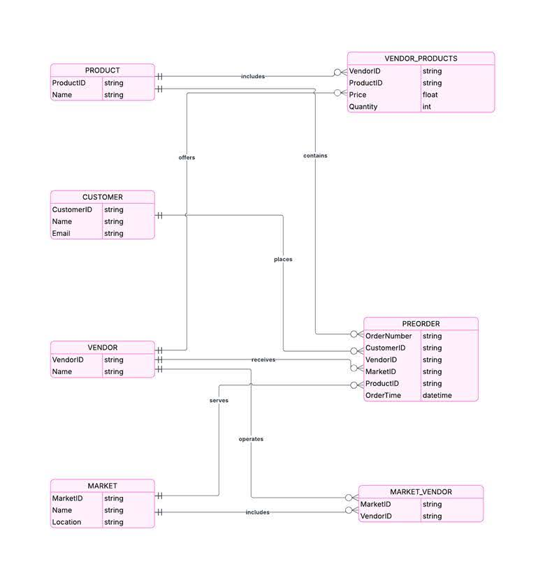
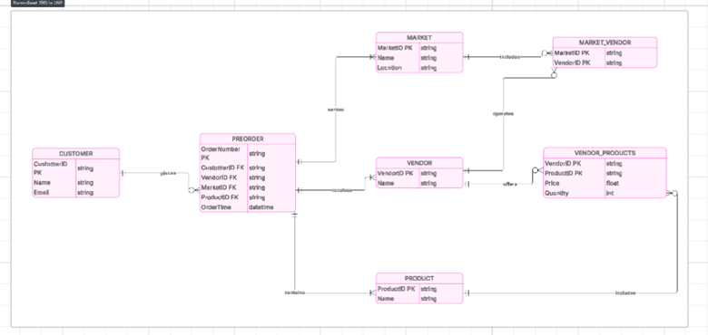

<h1>Normalization of our schema</h1>

<h3>Our Table information:</h3>

Customer:  Customer ID, Name, Email

Preorder:  Order number, Customer_ID, Vendor_ID, Market_ID, Product_ID, Order-time // Vendor: Name, Vendor_ID

Market-vendor:  Market ID, Vendor ID

Market:  Name, Location, Market ID

Vendor Products:  Vendor_ID, Product_ID, Price, Quantity

Product:  Product _ID, name

 

  

<h4>Relationships</h4>

Customer places Preorder

Vendor receives Preorder

Market includes Market-Vendor

Vendor operates Market-Vendor

Vendor offers Vendor Products

Product includes Vendor Products

Market serves Preorder

Product contains Preorder

 

<h3>With Normalization Done in LUCID CHART:</h3>

  

<h4>Entities and Attributes</h4>

<h6>Customer</h6>

CustomerID (Primary Key), Name, Email

<h6>Preorder</h6>

OrderNumber (Primary Key), CustomerID (Foreign Key), VendorID (Foreign Key), MarketID (Foreign Key), ProductID (Foreign Key), OrderTime

<h6>Vendor</h6>

VendorID (Primary Key), Name

<h6>Market-Vendor</h6>

MarketID (Primary Key), VendorID (Primary Key)

<h6>Market</h6>

MarketID (Primary Key), Name, Location

<h6>Vendor Products</h6>

VendorID (Primary Key), ProductID (Primary Key), Price, Quantity

<h6>Product</h6>

ProductID (Primary Key), Name

 

<h4>Relationships</h4>

Customer places Preorder

Preorder receives Vendor

Preorder serves Market

Preorder contains Product

Vendor operates Market-Vendor

Market includes Market-Vendor

Vendor offers Vendor Products

Product includes Vendor Products

 

<h4>Cardinalities</h4>

Customer to Preorder: 1:M

Preorder to Vendor:  M:1.

Preorder to Market: Each preorder serves one market, but a market can serve many preorders M:1

Preorder to Product: M:M.

Vendor to Market-Vendor: M:M

Vendor to Vendor Products: M:M

Market to Market-Vendor: M:M

